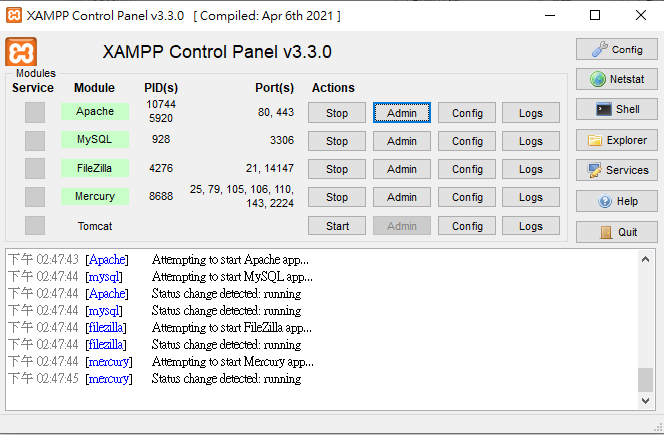

ˋˋˋ
Microsoft Windows [版本 10.0.19042.928]
(c) Microsoft Corporation. 著作權所有，並保留一切權利。

C:\Users\user>cd c:\xampp

c:\xampp>dir *.exe
 磁碟區 C 中的磁碟沒有標籤。
 磁碟區序號:  4A50-AC15

 c:\xampp 的目錄

2013/03/30  下午 08:29            60,928 service.exe
2021/10/07  下午 02:27        12,521,156 uninstall.exe
2021/04/06  下午 07:38         3,368,448 xampp-control.exe
2013/03/30  下午 08:29           118,784 xampp_start.exe
2013/03/30  下午 08:29           118,784 xampp_stop.exe


# 安裝XAMPP

# 安裝位置在C: 且目錄下共有5個執行檔 上圖連結為xampp-control.exe


```

<!DOCTYPE html>
<html>
<head>
    <title>Pooh Heeee!</title>
</head>
<body>

<h1>Haachamachama</h1>

<h9>哈洽馬洽馬洽馬</h9>
</body>
</html>

```
# 以下程式碼在使用中文時會產生亂碼，原因是編碼。

```
<!DOCTYPE html>
<html>
<head>
    <title>Pooh Heeee!</title>
</head>
<body>

<h1>Haachamachama</h1>

<h9>哈洽馬洽馬洽馬</h9>
<meta charset="utf-8">
</body>
</html>

```

# 加入<meta charset="utf-8">後可將編碼改為utf-8，如圖，此編碼支援中文。
# 即便家在文字後也依然可行。


