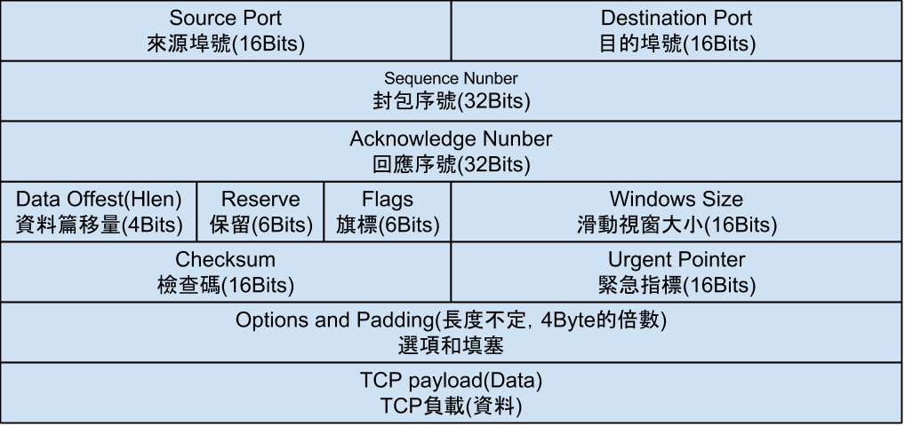

[感謝詳細的介紹](http://www.tsnien.idv.tw/Manager_WebBook/chap4/4-5%20TCP%20%E5%8D%94%E5%AE%9A%E8%88%87%E5%88%86%E6%9E%90.html)

連接埠Port
提供服務連接埠口(Port)：

(1) 0 ~ 1023：著名埠口，如 80/tcp 連接 http Server。

(2) 1024 ~ 65535：使用者或動態埠口。

TCP

三向交握 -> 三次握手 四次揮手 TCP是傳輸層協定 使用者要和伺服器建立連線會用到三向交握，指互相傳輸三次資料來確定連線，而斷線則是傳輸四次。

當中
Sequence Number
Acknowledge Number
是用來確定連線的數字 傳輸的人會設定 Acknowledge Number = Sequence Number 再隨機設定 Sequence Number 再傳出封包

UDP 

IPv4

IPv6

