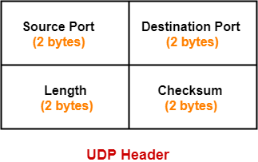
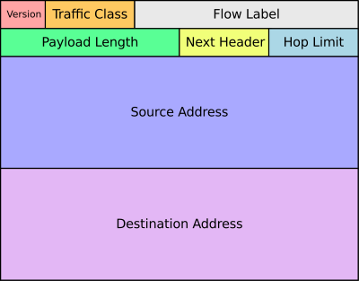

TCP

三向交握 -> 三次握手 四次揮手 TCP是傳輸層協定 使用者要和伺服器建立連線會用到三向交握，指互相傳輸三次資料來確定連線，而斷線則是傳輸四次。

當中
Sequence Number
Acknowledge Number
是用來確定連線的數字 傳輸的人會設定 Acknowledge Number = Sequence Number 再隨機設定 Sequence Number 再傳出封包

UDP 

IPv4

IPv6

